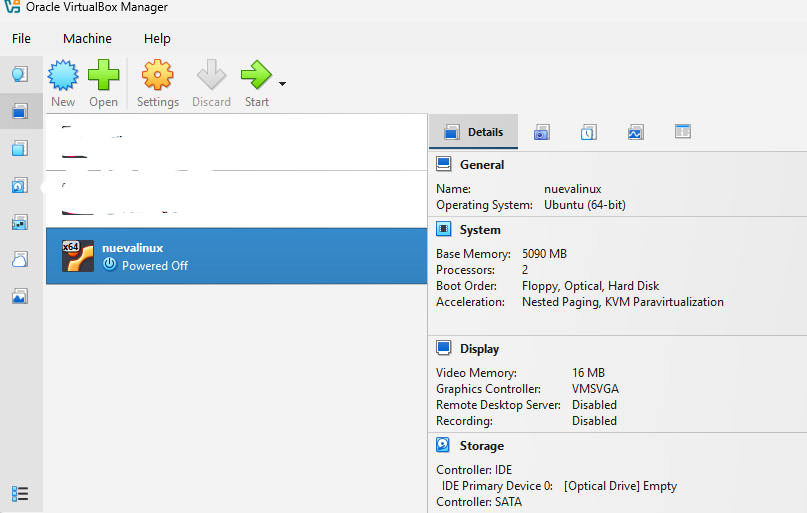
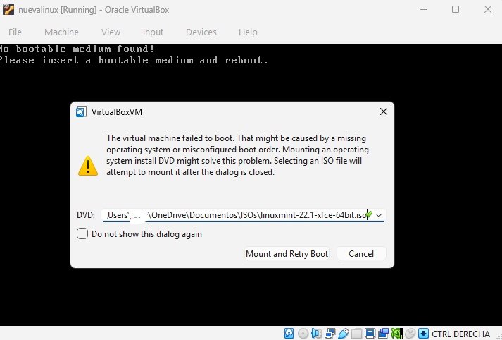
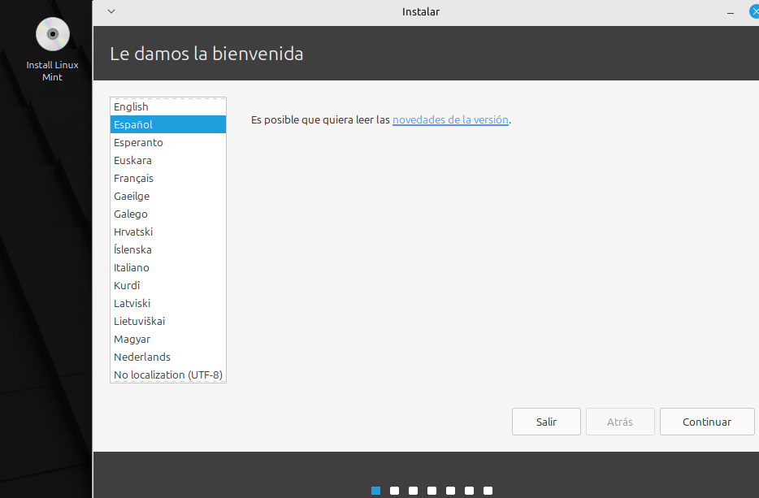
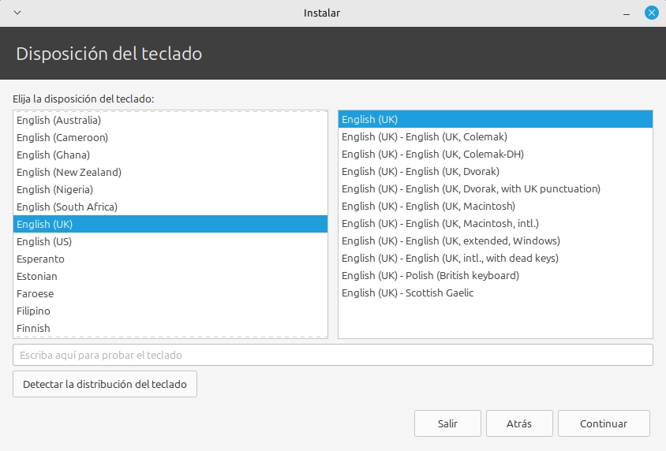
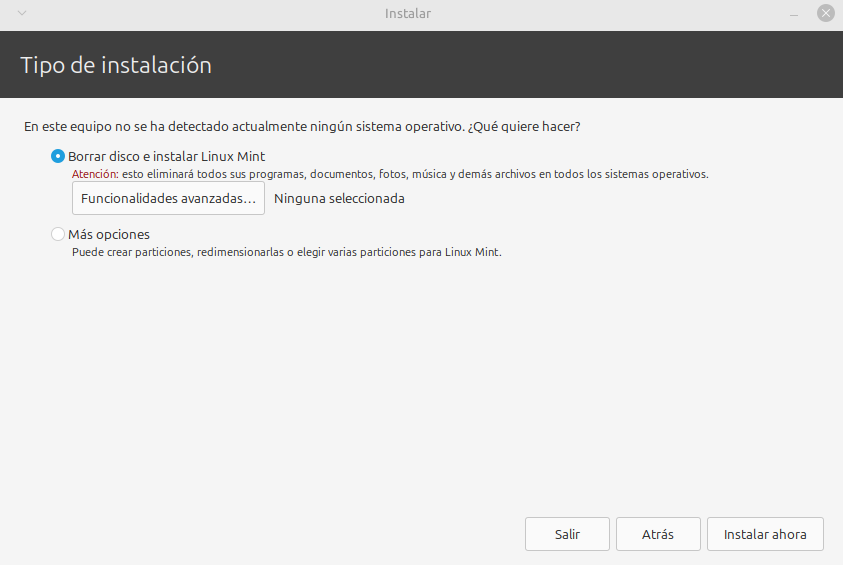
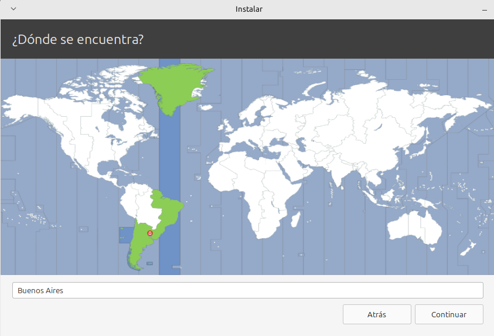
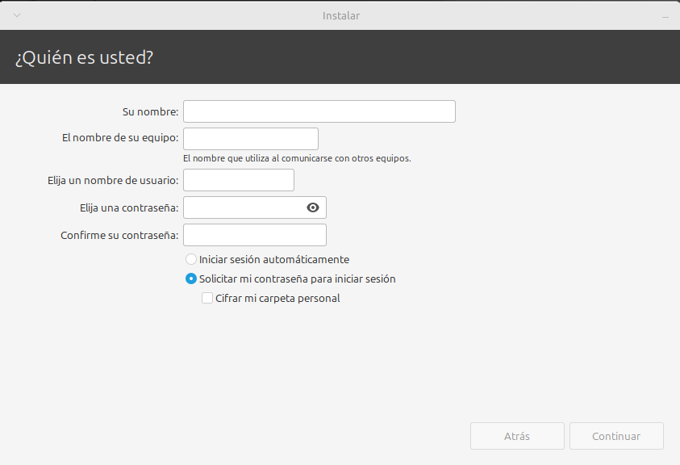
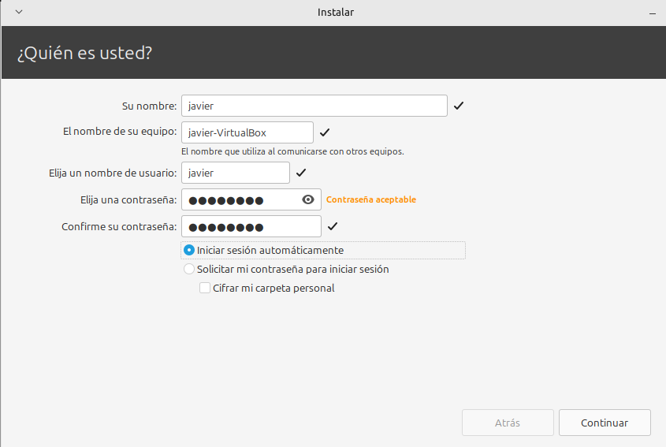
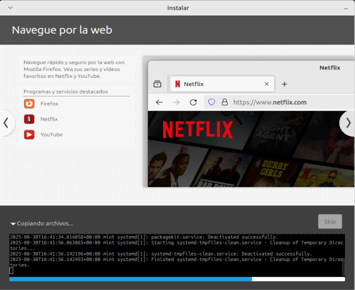

Con el objetivo de preparar un entorno de escritorio aislado para testeos y desarrollo, descartamos las versiones, Cinnamon y MATE a favor de XFCE por su bajo consumo de recursos.

Después de descargar el ISO desde la página oficial y una vez configurada la máquina virtual asignándole los recursos necesarios, comenzamos la instalación:

Al arrancar la máquina, VirtualBoxVM te vuelve a pedir la dirección del ISO.

Una vez aclarado ese punto, la máquina arranca en modo LIVE.

El menu ofrece seleccionar el idioma.

La distribuciòn de teclado de preferencia del usuario. Elijo UK porque alguna vez, con alguna distribución, tuve problemas de compatibilidad.

Lo que viene después asusta un poco, si no fuera porque es una máquina virtual y no hay nada que borrar porque justamente es un entorno totalmente aislado.

La zona horaria

El nombre del usuario y el password. Este paso es importante, para tener algún control sobre algunos comandos "sudo".

En pocos minutos, el sistema operativo está instalado y la máquina funcionando.

Hay que confirmar que se borre el medio de instalación. Eso no borra el ISO original, ya que estaba fuera de la carpeta asignada a la máquina virtual, por lo que queda disponible en su carpeta para seguir utilizándolo.

Linux Mint te pide la contraseña para arrancar.

Te da la bienvenida.

Y listo.

Tratándose en este caso de una máquina virtual, no hay que olvidar que para que el teclado pueda operar fuera de la máquina virtual, debe presionarse una vez la tecla control de la derecha solamente.
